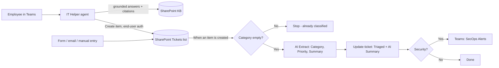

# AI Agents with Copilot Studio — Internal Service Desk & Public Website Chatbot

Two AI agents built in a Microsoft 365 lab tenant for a fictional company, **Brackenridge**:

1. **An internal IT service desk**: a Teams agent that answers employees from a knowledge base and opens tickets, plus an autonomous workflow that triages every new ticket and escalates security incidents to a SecOps Teams channel.
2. **A public website chatbot**: a customer-facing assistant for anonymous visitors, isolated in its own environment.

> Lab project built to learn enterprise AI automation end to end: grounding, tools, autonomous workflows, evaluation and governance.

---

## What it does

**IT Helper agent (Copilot Studio, published to Microsoft Teams)**
- Answers IT questions **only** from a SharePoint knowledge base, with citations
- Says "I don't have that information" instead of guessing, and offers to open a ticket
- Creates tickets in a SharePoint list using the **employee's own permissions** (end-user authentication)
- Asks clarifying questions when a decision depends on missing information (e.g. "did you enter your password?" before setting priority on a phishing report)

**Ticket Auto-Triage workflow (Copilot Studio Workflows)**
- Fires automatically when a new ticket arrives from any source
- Uses AI to assign **Category** (Access / Hardware / Software / Security) and **Priority** (P1–P4)
- Writes an **AI Summary** explaining *why* it chose that category and priority
- Sets status to **Triaged**
- Posts a **🚨 security alert** to a SecOps Teams channel for Security tickets

---

## Architecture

---

## Key design decisions

| Decision | Why |
|---|---|
| **Knowledge grounding only** (web search and general knowledge off) | Prevents the agent from sending employees to unrelated public sites or inventing procedures |
| **Fixed vs AI-filled tool inputs** | Site, list and initial status are locked; only Title, Description, Category and Priority are AI-filled. The AI gets judgment only where judgment is needed |
| **Field-level descriptions** on Category and Priority | Define allowed values and meanings, e.g. "any Security ticket is minimum P2" |
| **End-user authentication** on the ticket tool | The agent can never do more than the user chatting with it |
| **Loop guard** (only triage tickets where Category is empty) | Tickets already classified by the agent skip the workflow; trigger is *created*, not *modified*, so updates don't re-fire it |
| **AI Summary column** | Explainability: technicians can audit every AI decision in seconds |
| **Separate dev environment** | Agents built in an isolated Developer environment, not the Default environment |

---

## Testing & results

**Triage workflow — 15-case test set: 15/15 correct (100%)**

The set was designed to include deliberate edge cases:

| Edge case | Risk | Result |
|---|---|---|
| "Can't sign in after phone change" | Mentions a phone, could be misread as Hardware | ✅ Access / P2 |
| "Whole office can't access email" | Outage vs single user | ✅ Software / P1 |
| "How do I set up email on my phone?" | A question, not an incident | ✅ Software / P4 |
| "Laptop slow and fans loud" + unknown programs | Looks like Hardware, hides a security signal | ✅ Security / P2 |
| "Clicked link and entered password" | Credential compromise | ✅ Security / P1 |

**Agent — Copilot Studio Evaluate:** separate test conversations covering KB answers, ticket creation, unknown topics and out-of-scope requests. Every change was followed by a full re-run to catch regressions.

*Note: this is a small lab test set I designed; it validates behaviour on known edge cases rather than proving production-scale accuracy.*

---

## Governance

- **Published to Teams only** — where employees already work, no per-user Copilot licensing required
- **Maker vs admin separation** — submitted to the org catalog and approved in the Teams admin center before org-wide availability
- **Power Platform DLP policy** — SharePoint, Teams, Outlook and Dataverse grouped as Business; Dropbox, Gmail and X blocked; unauthenticated agent chat blocked. Verified by attempting to add a Dropbox tool (blocked by policy)
- **Production note** — background workflows run under the connection owner's account; in production this would be a dedicated least-privilege service account, not a personal admin account

---

## Problems I hit and how I solved them

| Problem | Root cause | Fix |
|---|---|---|
| Agent answered from unrelated public websites | Web search enabled by default | Removed web knowledge; grounded in SharePoint only |
| Agent offered actions it couldn't perform ("I'll escalate it to P1") | Instructions guide but don't enforce; no Update tool | Tightened instructions; kept promises within available tools |
| Phishing ticket rated P3 | Priority rule said P1 = "many users", so the AI followed it literally | Rewrote the rule: any Security ticket is minimum P2 |
| Password answer regressed after adding a tool | Knowledge source dropped; agent browsed the list via the tool instead | Re-added knowledge; instruction to search knowledge first |
| Workflow ran "successfully" but updated nothing | Classify node routes to separate branches; merging five branches into one node created a join that always skipped | Replaced routing with a single AI Extract step for labelling |
| Choice columns couldn't accept dynamic values | Designer only offers fixed choices for Choice columns | Converted Category and Priority to text; AI step enforces allowed values |
| Correct refusal failed evaluation | "General quality" grader rewards answers that solve the problem | Kept the correct behaviour rather than tuning the agent to game the metric |
| Evaluation runs created real tickets | Evaluations execute real tools | Noted the side effect; production testing belongs in a separate environment |

---

## Part 2: Public website chatbot

A customer-facing assistant for **Brackenridge Supply Co.**, a fictional industrial and safety supplier, embedded on a website for anonymous visitors.

**What it does**
- Answers questions about store hours, shipping, returns, damaged items and bulk quotes
- Grounded only in a public customer FAQ; when it doesn't know, it gives the support phone number and email

**How it differs from the internal agent**

| | IT Helper (internal) | Website Assistant (public) |
|---|---|---|
| Users | Employees, signed in | Anyone, anonymous |
| Authentication | Microsoft Entra ID | None |
| Knowledge | Internal SharePoint | Public FAQ only |
| Actions | Creates tickets as the user | Answers only |
| Environment | Brackenridge-Dev (DLP blocks anonymous chat) | Brackenridge-Public (separate) |
| Channel | Microsoft Teams | Website embed |

**Design decisions**
- **Separate environment**: the internal environment's DLP policy blocks unauthenticated chat, so the public bot lives in its own environment and can never reach internal data
- **Public knowledge only**: no internal SharePoint, no web search, no general knowledge
- **Verified anonymously**: tested in a private browser window with no sign-in
- **Cost awareness**: unauthenticated bots let anyone send messages, and every message consumes credits, so usage needs monitoring in production

---

## Tech stack

Microsoft Copilot Studio · Copilot Studio Workflows (Power Automate) · SharePoint Online · Microsoft Teams · Power Platform admin center · Teams admin center · Microsoft Dataverse · Microsoft Entra ID

---

## Screenshots

| | |
|---|---|
| Workflow canvas | `screenshots/workflow.png` |
| Triaged tickets with AI Summary | `screenshots/tickets.png` |
| Teams security alert | `screenshots/teams-alert.png` |
| Agent answering in Teams | `screenshots/agent-teams.png` |
| DLP policy blocking Dropbox | `screenshots/dlp-block.png` |
| Evaluation results | `screenshots/evaluate.png` |
| Website chatbot answering anonymously | `screenshots/website-bot.png` |

---

## What I'd add next

- ServiceNow integration (Incident table, impact/urgency, assignment groups) in place of the SharePoint list
- Human-review step for low-confidence triage decisions
- Update-ticket tool so the agent can change priority when a user reports new information
- Lead-capture tool on the website chatbot, saving bulk-quote requests to a list for the sales team
- Live-agent handoff for website visitors the bot can't help

---

**Author:** Amit Kumar — Systems Administrator · [LinkedIn](https://linkedin.com/in/amitkumarsysadmin) · [GitHub](https://github.com/AmitKJagga)
